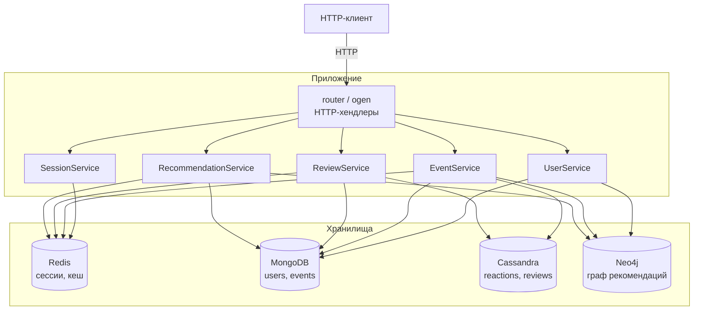
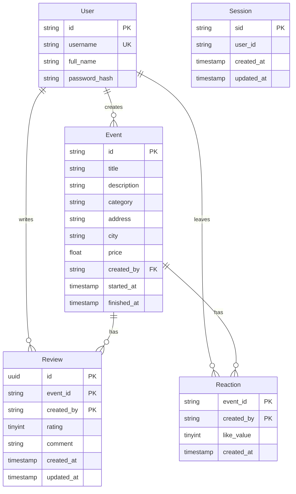

# ndbx


Backend-сервис для платформы мероприятий, реализованный с использованием четырёх NoSQL-СУБД:  
**MongoDB** (пользователи, события), **Cassandra** (реакции, отзывы), **Redis** (сессии, кеши), **Neo4j** (граф рекомендаций).  
HTTP-контракт и серверная обвязка автогенерируются из TypeSpec/OpenAPI через [ogen](https://github.com/ogen-go/ogen).

---

## Технологический стек

| Компонент | Технология | Версия | Назначение |
|-----------|-----------|--------|------------|
| Язык | Go | 1.25 | Основной язык разработки |
| Система сборки | Make + go build | — | Сборка и автоматизация |
| Документация API | TypeSpec → OpenAPI 3.0 → ogen | — | Контракт-first разработка |
| БД — документы | MongoDB | 8.0 | Пользователи и события (sharded cluster) |
| БД — широкие столбцы | Cassandra | 4.1 | Реакции (лайки) и отзывы на события |
| БД — ключ-значение | Redis | 8.6 | Сессии, кеш реакций/отзывов/рекомендаций |
| БД — граф | Neo4j | 5 | Коллаборативная фильтрация рекомендаций |
| Контейнеризация | Docker Compose | — | Локальная разработка и развёртывание |
| Логирование | zerolog | v1.34 | Структурированное логирование |
| Тестирование | testify + mockio | — | Unit-тесты с моками |
| Линтер | golangci-lint | — | Статический анализ кода |

### Ключевые библиотеки

| Библиотека | Назначение |
|------------|------------|
| [`ogen`](https://github.com/ogen-go/ogen) | Генерация HTTP-сервера из OpenAPI-спецификации |
| [`go-redis/v9`](https://github.com/redis/go-redis) | Клиент Redis |
| [`mongo-driver`](https://go.mongodb.org/mongo-driver) | Официальный драйвер MongoDB |
| [`gocql`](https://github.com/gocql/gocql) | Драйвер Cassandra |
| [`neo4j-go-driver`](https://github.com/neo4j/neo4j-go-driver) | Официальный драйвер Neo4j |
| [`bcrypt`](https://pkg.go.dev/golang.org/x/crypto/bcrypt) | Хеширование паролей |
| [`errgroup`](https://pkg.go.dev/golang.org/x/sync) | Управление горутинами и ошибками |
| [`cors`](https://github.com/rs/cors) | CORS-middleware |
| [`go-env-validator`](https://github.com/pedrobarbosak/go-env-validator) | Валидация и парсинг env-переменных |

---

## Архитектура проекта

### Структура пакетов

```
ndbx/
├── cmd/app/                  # Точка входа приложения (main.go)
├── config/                   # Загрузка и валидация конфигурации
├── internal/
│   ├── app/                  # Инициализация зависимостей, жизненный цикл
│   ├── router/               # HTTP-хендлеры и сгенерированный ogen-код
│   │   └── ogen/             # Автосгенерированные типы, роутер, кодеки
│   ├── service/              # Бизнес-логика
│   │   └── dto/              # Data Transfer Objects (service layer)
│   └── storage/              # Реализации хранилищ
│       ├── cassandra/        # Cassandra: реакции, отзывы
│       ├── mongodb/          # MongoDB: пользователи, события
│       │   └── dto/          # DTO хранилища MongoDB
│       ├── neo4j/            # Neo4j: граф рекомендаций
│       └── redis/            # Redis: сессии, кеши
│           └── dto/          # DTO хранилища Redis
├── pkg/                      # Переиспользуемые пакеты
│   ├── cassandra/            # Обёртка клиента Cassandra
│   ├── cryptic/              # Генерация session ID
│   ├── httpserver/           # HTTP-сервер, middleware, валидаторы
│   ├── logger/               # Логирование (zerolog)
│   ├── mongodb/              # Обёртка клиента MongoDB
│   ├── neo4j/                # Обёртка клиента Neo4j
│   └── redis/                # Обёртка клиента Redis
├── docs/                     # TypeSpec-спецификация, OpenAPI, Swagger/ReDoc
├── scripts/cassandra/        # Инициализация схемы Cassandra (CQL)
├── .env.local                # Переменные окружения для локальной разработки
├── docker-compose.yml        # Оркестрация всех сервисов
├── Dockerfile                # Многоэтапная сборка Go-приложения
└── Makefile                  # Команды сборки, запуска, генерации
```

### Схема взаимодействия компонентов



### Основные сущности и связи



### Схема данных в MongoDB (sharded cluster)

Коллекция `events` шардирована по полю `created_by` (hashed key):

```dbml
Table users {
  _id ObjectId [pk]
  username string [unique, not null]
  full_name string [not null]
  password_hash string [not null]
}

Table events {
  _id ObjectId [pk]
  title string [not null]
  description string
  category string
  address string
  city string
  price double
  created_by string [not null, note: 'shard key (hashed)']
  started_at timestamp [not null]
  finished_at timestamp
  created_at timestamp [not null]
  updated_at timestamp [not null]
}
```

### Схема данных в Cassandra

```dbml
Table event_reactions {
  event_id text [pk, note: 'partition key']
  created_by text [pk, note: 'clustering key']
  like_value tinyint [note: '1 = like, -1 = dislike']
  created_at timestamp
}

Table event_reviews {
  event_id text [pk, note: 'partition key']
  created_by text [pk, note: 'clustering key']
  id uuid [note: 'generated by Cassandra uuid()']
  rating tinyint
  comment text
  created_at timestamp
  updated_at timestamp
}
```

---

## Функциональные требования / Use Cases

### 1. Управление сессией
- **Healthcheck** — проверка доступности сервиса; продлевает сессию, если передана кука.
- **Создание анонимной сессии** — генерация нового session ID, сохранение в Redis с TTL.
- **Продление сессии** — обновление SID и TTL при повторном запросе с существующей кукой.
- **Выход из сессии** — удаление сессии из Redis.

### 2. Управление пользователями
- **Регистрация** — создание учётной записи (хеширование пароля bcrypt), создание узла в Neo4j.
- **Аутентификация** — проверка логина/пароля, привязка сессии к пользователю.
- **Просмотр профиля** — получение данных пользователя по ID.
- **Список пользователей** — получение пользователей с фильтрацией по ID и имени.

### 3. Управление событиями
- **Создание события** — авторизованный пользователь создаёт событие; создаётся узел в Neo4j.
- **Просмотр событий** — получение списка событий с фильтрацией по названию, категории, цене, городу, датам, автору.
- **Просмотр события** — получение детальной информации по ID.
- **Частичное обновление** — изменение полей события авторизованным автором.

### 4. Реакции на события
- **Лайк / Дизлайк** — оставление реакции (upsert в Cassandra, кеширование в Redis, создание связи LIKED в Neo4j).
- **Получение реакций** — агрегация количества лайков/дизлайков по событиям (из кеша или Cassandra).

### 5. Отзывы на события
- **Создание отзыва** — авторизованный пользователь оставляет отзыв с рейтингом и комментарием (UUID генерируется Cassandra через `uuid()`).
- **Просмотр отзывов** — получение отзывов по событию.
- **Обновление отзыва** — изменение рейтинга и/или комментария.
- **Статистика отзывов** — агрегация количества и суммы рейтингов по событиям.

### 6. Рекомендации
- **Персональные рекомендации** — коллаборативная фильтрация через Neo4j: «пользователи с похожими лайками также лайкали…». Результат кешируется в Redis.

---

## API

Полная спецификация доступна после запуска сервиса:

- **Swagger UI**: [http://localhost:8080/api/swagger](http://localhost:8080/api/swagger)
- **ReDoc**: [http://localhost:8080/api/docs](http://localhost:8080/api/docs)
- **OpenAPI-файл**: [`docs/openapi.yaml`](docs/openapi.yaml)

### Основные endpoint-ы

| Метод | Путь | Описание | Авторизация |
|-------|------|----------|-------------|
| `GET` | `/health` | Healthcheck + продление сессии | Нет |
| `POST` | `/session` | Создание/продление анонимной сессии | Нет |
| `POST` | `/users` | Регистрация пользователя | Нет |
| `POST` | `/auth/login` | Аутентификация, привязка сессии | Нет |
| `POST` | `/auth/logout` | Завершение пользовательской сессии | Да |
| `POST` | `/events` | Создание события | Да |
| `GET` | `/events` | Получение списка событий с фильтрами | Нет |
| `GET` | `/events/{id}` | Получение события по ID | Нет |
| `PATCH` | `/events/{id}` | Частичное обновление события | Да (автор) |
| `GET` | `/users` | Список пользователей | Нет |
| `GET` | `/users/{id}` | Профиль пользователя | Нет |
| `GET` | `/users/{id}/events` | События пользователя | Нет |
| `POST` | `/events/{id}/like` | Лайк события | Да |
| `POST` | `/events/{id}/dislike` | Дизлайк события | Да |
| `POST` | `/events/{id}/reviews` | Создание отзыва | Да |
| `GET` | `/events/{id}/reviews` | Отзывы на событие | Нет |
| `PATCH` | `/events/{id}/reviews` | Обновление отзыва | Да (автор) |
| `GET` | `/recommendations` | Персональные рекомендации | Да |

### Примеры запросов и ответов

<details>
<summary>POST /users — Регистрация</summary>

**Запрос:**

```bash
curl -X POST http://localhost:8080/users \
  -H "Content-Type: application/json" \
  -d '{"username": "johndoe", "full_name": "John Doe", "password": "secret123"}'
```

**Ответ (201):**

```json
{
  "id": "683a1b2c3d4e5f6a7b8c9d0e"
}
```

</details>

<details>
<summary>POST /auth/login — Аутентификация</summary>

**Запрос:**

```bash
curl -X POST http://localhost:8080/auth/login \
  -H "Content-Type: application/json" \
  -b "X-Session-Id=abc123" \
  -d '{"username": "johndoe", "password": "secret123"}'
```

**Ответ (204):** Set-Cookie header с обновлённым SID.

</details>

<details>
<summary>POST /events — Создание события</summary>

**Запрос:**

```bash
curl -X POST http://localhost:8080/events \
  -H "Content-Type: application/json" \
  -b "X-Session-Id=abc123" \
  -d '{
    "title": "Go Meetup",
    "description": "Ежемесячная встреча Go-разработчиков",
    "category": "tech",
    "address": "ул. Ленина, 42",
    "city": "Москва",
    "price": 0,
    "started_at": "2026-07-01T18:00:00Z",
    "finished_at": "2026-07-01T21:00:00Z"
  }'
```

**Ответ (201):**

```json
{
  "id": "683a1b2c3d4e5f6a7b8c9d0e"
}
```

</details>

<details>
<summary>GET /events — Список событий</summary>

**Запрос:**

```bash
curl "http://localhost:8080/events?city=Москва&limit=5&offset=0"
```

**Ответ (200):**

```json
{
  "events": [
    {
      "id": "683a1b2c3d4e5f6a7b8c9d0e",
      "title": "Go Meetup",
      "description": "Ежемесячная встреча Go-разработчиков",
      "category": "tech",
      "address": "ул. Ленина, 42",
      "city": "Москва",
      "price": 0,
      "created_by": "683a1b2c3d4e5f6a7b8c9d0e",
      "started_at": "2026-07-01T18:00:00Z",
      "finished_at": "2026-07-01T21:00:00Z",
      "likes": 5,
      "dislikes": 1,
      "review_count": 3,
      "review_avg_rating": 4.3
    }
  ]
}
```

</details>

<details>
<summary>POST /events/{id}/reviews — Создание отзыва</summary>

**Запрос:**

```bash
curl -X POST http://localhost:8080/events/683a1b2c3d4e5f6a7b8c9d0e/reviews \
  -H "Content-Type: application/json" \
  -b "X-Session-Id=abc123" \
  -d '{"rating": 5, "comment": "Отличное мероприятие!"}'
```

**Ответ (201):**

```json
{
  "id": "550e8400-e29b-41d4-a716-446655440000"
}
```

</details>

<details>
<summary>GET /recommendations — Рекомендации</summary>

**Запрос:**

```bash
curl http://localhost:8080/recommendations \
  -b "X-Session-Id=abc123"
```

**Ответ (200):**

```json
{
  "events": [
    {
      "id": "683a1b2c3d4e5f6a7b8c9d0e",
      "title": "Go Meetup",
      "category": "tech",
      "city": "Москва",
      "price": 0
    }
  ]
}
```

</details>

---

## Инструкция по запуску

### Предварительные требования

- [Docker](https://docs.docker.com/get-docker/) и Docker Compose v2+
- [Go](https://go.dev/dl/) 1.25+ (для локального запуска)
- [Make](https://www.gnu.org/software/make/) (опционально, для команд Makefile)
- [Node.js](https://nodejs.org/) и [TypeSpec CLI](https://typespec.io/) (для генерации кода)

### 1. Клонирование репозитория

```bash
git clone <repo-url>
cd ndbx
```

### 2. Настройка переменных окружения

Скопируйте и отредактируйте файл конфигурации:

```bash
cp .env.local .env.local
```

Минимальная конфигурация для локального запуска уже задана в `.env.local`.  
См. раздел [Конфигурация](#конфигурация) для полного списка переменных.

### 3. Запуск в Docker Compose

Поднимает все сервисы (Redis, MongoDB sharded cluster, Cassandra, Neo4j, backend):

```bash
make run
```

Остановка:

```bash
make stop
```

Полная очистка включая volumes:

```bash
make clean
```

### 4. Локальный запуск (без Docker)

Требуются запущенные экземпляры Redis, MongoDB, Cassandra и Neo4j.  
Укажите их адреса в `.env.local`, затем:

```bash
make run-local
```

### 5. Проверка работоспособности

```bash
curl http://localhost:8080/health
```

Ожидаемый ответ:

```json
{"status":"ok"}
```

---

## Конфигурация

Приложение читает переменные окружения из файла, путь к которому задаётся через `CONFIG_PATH`.  
Формат файла — `KEY=VALUE`.

| Переменная | Описание | Значение по умолчанию |
|------------|----------|----------------------|
| `LOG_LEVEL` | Уровень логирования (`debug`, `info`, `warn`, `error`) | `info` |
| `APP_HOST` | Адрес привязки HTTP-сервера | `0.0.0.0` |
| `APP_PORT` | Порт HTTP-сервера | `8080` |
| `PPROF_PORT` | Порт pprof-сервера для профилирования | `6060` |
| `APP_USER_SESSION_TTL` | TTL пользовательской сессии (секунды) | `20` |
| `APP_LIKE_TTL` | TTL кеша реакций (секунды) | `60` |
| `APP_EVENT_REVIEWS_TTL` | TTL кеша отзывов (секунды) | `120` |
| `APP_RECOMMENDATIONS_TTL` | TTL кеша рекомендаций (секунды) | `60` |
| `REDIS_HOST` | Хост Redis | `redis` |
| `REDIS_PORT` | Порт Redis | `6379` |
| `REDIS_PASSWORD` | Пароль Redis (пустая строка — без пароля) | — |
| `REDIS_DB` | Номер базы Redis | `0` |
| `MONGODB_HOST` | Хост MongoDB (mongos для sharded cluster) | `mongos` |
| `MONGODB_PORT` | Порт MongoDB | `27017` |
| `MONGODB_USER` | Пользователь MongoDB | — |
| `MONGODB_PASSWORD` | Пароль MongoDB | — |
| `MONGODB_DATABASE` | Имя базы данных MongoDB | `eventhub` |
| `CASSANDRA_HOSTS` | Список хостов Cassandra (через запятую) | `cassandra` |
| `CASSANDRA_PORT` | Порт Cassandra | `9042` |
| `CASSANDRA_USERNAME` | Пользователь Cassandra | — |
| `CASSANDRA_PASSWORD` | Пароль Cassandra | — |
| `CASSANDRA_KEYSPACE` | Keyspace Cassandra | `testkeyspace` |
| `CASSANDRA_CONSISTENCY` | Уровень консистентности (`ONE`, `QUORUM`, …) | `ONE` |
| `NEO4J_URL` | URL подключения Neo4j (bolt://) | `bolt://neo4j:7687` |
| `NEO4J_USERNAME` | Пользователь Neo4j | `neo4j` |
| `NEO4J_PASSWORD` | Пароль Neo4j | `password` |
| `NEO4J_BOLT_PORT` | Bolt-порт Neo4j | `7687` |
| `NEO4J_HTTP_PORT` | HTTP-порт Neo4j | `7474` |

---

## Тестирование

### Запуск тестов

```bash
make test
```

Или напрямую:

```bash
go test --race --count=1 ./...
```

### Запуск бенчмарков

```bash
make bench
```

### Запуск линтера

```bash
make lint
```

### Что покрыто

- **Unit-тесты**: HTTP-хендлеры (`internal/router/handler_test.go`) — табличные тесты с моками сервисов через [mockio](https://github.com/ovechkin-dm/mockio).
- **Интеграционные тесты**: пока отсутствуют (требуют запущенных СУБД).

---

## Генерация кода

```bash
make code-gen
```

Команда последовательно:
1. `tsp install` — установка зависимостей TypeSpec.
2. `tsp compile` — компиляция TypeSpec → OpenAPI 3.0 (`docs/openapi.yaml`).
3. `ogen` — генерация Go-кода сервера в `internal/router/ogen/`.

---

## Профилирование

После запуска сервиса доступен pprof на порту `6060`:

```bash
# CPU-профиль
go tool pprof -http=:8080 http://localhost:6060/debug/pprof/profile?seconds=10

# Трассировка
go tool pprof -http=:8080 http://localhost:6060/debug/pprof/trace?seconds=10
```

---

## Разработка

Правила внесения изменений описаны в [CONTRIBUTING.md](CONTRIBUTING.md).  
Ответственные за ревью указаны в [CODEOWNERS](CODEOWNERS).
