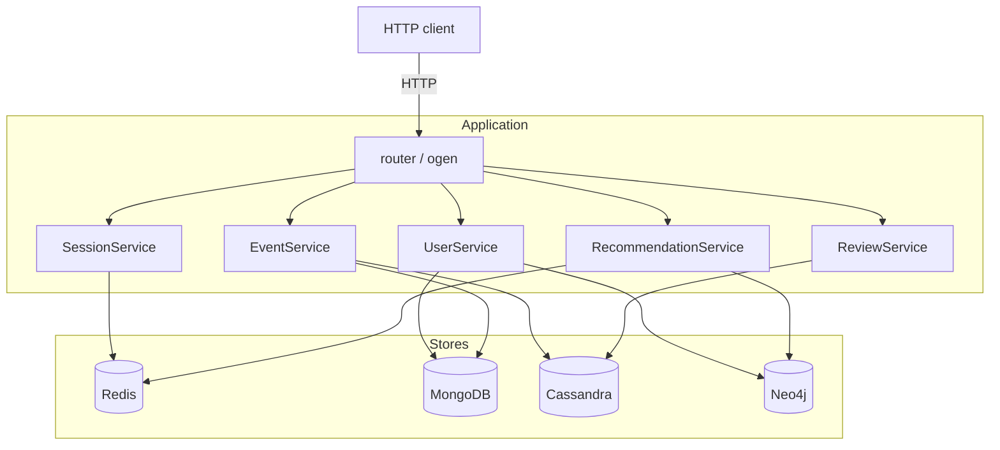
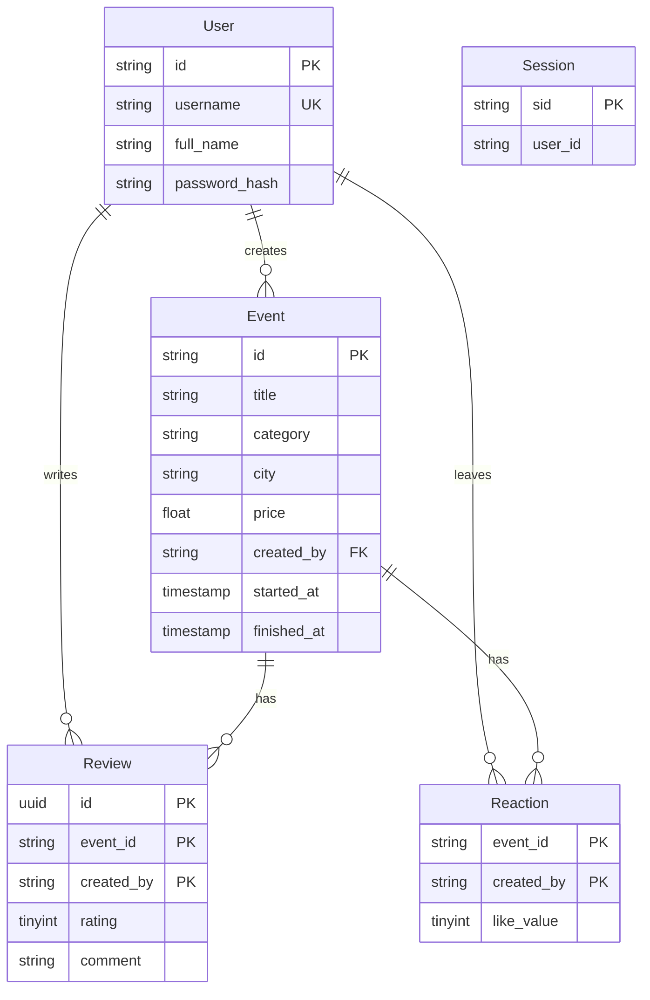

# ndbx

A backend for an events platform, written to put four NoSQL databases against the parts of
one workload each of them is actually built for. The HTTP contract is written in TypeSpec
first and the server code is generated from it with [ogen](https://github.com/ogen-go/ogen),
so the specification and the handlers cannot drift apart.

## Why four databases

| Store | Holds | Reason |
|-------|-------|--------|
| MongoDB | Users and events | Documents of varying shape, sharded by author with a hashed key |
| Cassandra | Reactions and reviews | Append-heavy writes keyed by event, which is what a wide-column store is for |
| Redis | Sessions and caches | Short-lived keys with expiry, read on nearly every request |
| Neo4j | The recommendation graph | Collaborative filtering is a graph traversal, not a join |

Recommendations follow from that last choice: users who liked what you liked are one hop
away in the graph, and the answer is cached in Redis rather than recomputed per request.



## Entities



## API

| Method | Path | Auth |
|--------|------|------|
| `POST` | `/session` | no |
| `POST` | `/users` | no |
| `POST` | `/auth/login`, `/auth/logout` | login no, logout yes |
| `POST` `GET` | `/events` | create yes, list no |
| `GET` `PATCH` | `/events/{id}` | read no, update author only |
| `POST` | `/events/{id}/like`, `/events/{id}/dislike` | yes |
| `POST` `GET` `PATCH` | `/events/{id}/reviews` | read no, write yes |
| `GET` | `/users/{id}`, `/users/{id}/events` | no |
| `GET` | `/recommendations` | yes |

The generated Swagger and ReDoc pages are served from `docs/`.

## Running

Everything comes up together, the backend along with Redis, a sharded MongoDB cluster,
Cassandra and Neo4j.

```bash
make run
make stop
make clean
```

## Development

```bash
make test
make bench
make lint
make code-gen
```

`code-gen` installs the TypeSpec dependencies, compiles the specification into
`docs/openapi.yaml` and regenerates the server into `internal/router/ogen/`. Handlers are
covered by table tests with the services mocked through
[mockio](https://github.com/ovechkin-dm/mockio); integration tests are not there, since they
would need all four databases running.
